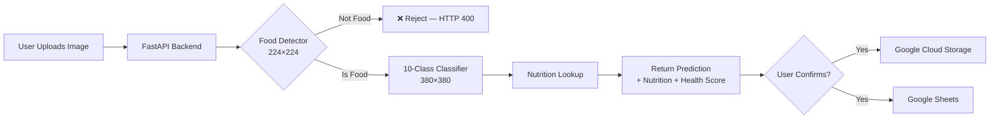

<p align="center">
  
  
  
  
</p>

# 🍔 Nutrify — AI-Powered Food Recognition

**Nutrify** is an intelligent food recognition platform that uses deep learning to identify food from images, provide nutritional information, and compute a health score. Built with FastAPI, TensorFlow, and Google Cloud.

---

## ✨ Features

- 🔍 **Food Detection** — Binary classifier distinguishes food from non-food images before classification
- 🧠 **10-Class Classification** — Identifies apple, banana, beef, blueberries, carrots, chicken wings, egg, honey, mushrooms, strawberries
- 🥗 **Nutrition Info** — Returns protein, fat, carbs, and calorie data per food
- 💚 **Health Score** — Computes a 0–10 health rating based on nutritional rules
- 📤 **Image Storage** — Uploads confirmed images to Google Cloud Storage
- 📊 **Metadata Logging** — Records uploads to Google Sheets for dataset tracking
- 🎨 **Modern UI** — Clean single-page web interface

---

## 🏗️ Architecture



---

## 🛠️ Tech Stack

| Layer                | Technology                      |
| -------------------- | ------------------------------- |
| **Backend**          | FastAPI, Uvicorn                |
| **ML Framework**     | TensorFlow / Keras              |
| **Frontend**         | HTML, CSS, JavaScript (vanilla) |
| **Cloud Storage**    | Google Cloud Storage            |
| **Database**         | Google Sheets (metadata)        |
| **Environment**      | Conda (Python 3.11)             |
| **Image Processing** | Pillow, OpenCV, NumPy           |

---

## 📁 Project Structure

```
Nutrify/
├── frontend/                    # 🌐 Web UI
│   ├── index.html
│   ├── app.js
│   └── styles.css
├── config/                      # ⚙️ Environment & credentials
│   ├── environment.yml
│   ├── google-drive-creds.json
│   ├── google-sheets-creds.json
│   └── google-storage-creds.json
├── notebooks/                   # 📓 Jupyter notebooks
│   ├── data_download.ipynb
│   └── train_test_split.ipynb
├── scripts/                     # 🔧 Utility scripts
│   ├── food_image_collector.py
│   └── connect_to_db.py
├── main.py                      # FastAPI server
├── utils.py                     # Cloud Storage upload helpers
├── save_to_gsheets.py           # Google Sheets integration
├── image_uploader.py            # GCS client factory
├── google_credentials.py        # Credential loader
├── model/                       # 🧠 Trained models
│   ├── food-10-version.keras
│   └── food_or_not_food_detector.keras
├── data/                        # 📦 Raw dataset
├── data_exploration/            # 📊 USDA analysis + nutrition CSV
├── 10_whole_foods/              # 🏋️ Train/test split
├── sample_food_images/          # 🖼️ Test images
└── query/                       # 📋 SQL queries
```

---

## 🚀 Quick Start

### Prerequisites

- Python 3.11+
- Conda (recommended)
- Google Cloud service account credentials

### 1. Clone & Setup Environment

```bash
git clone <https://github.com/PaingLinHtike/Nutrify.git>
cd Nutrify

# Create conda environment
conda env create -f config/environment.yml
conda activate nutrify
```

### 2. Configure Credentials

Place your Google Cloud service account JSON files in `config/`:

- `google-storage-creds.json` — for Cloud Storage
- `google-sheets-creds.json` — for Google Sheets API
- `google-drive-creds.json` — for Google Drive API

### 3. Start the Server

```bash
# Development (uses test resources)
set TEST_NUTRIFY_ENV_VAR=True
uvicorn main:app --host 0.0.0.0 --port 8000

# Production
set TEST_NUTRIFY_ENV_VAR=False
uvicorn main:app --host 0.0.0.0 --port 8000
```

### 4. Open the App

Visit **[http://localhost:8000](http://localhost:8000)** in your browser.

---

## 🔌 API Endpoints

### `GET /`

Serves the single-page web application.

### `POST /predict`

Upload an image for food detection and classification.

**Request:** `multipart/form-data` with `file` field (JPEG/PNG)

**Response (food detected):**

```json
{
  "is_food": true,
  "food_detection_confidence": 0.98,
  "prediction": "apple",
  "confidence": 0.94,
  "top_predictions": [
    { "label": "apple", "confidence": 0.94 },
    { "label": "banana", "confidence": 0.03 },
    { "label": "strawberries", "confidence": 0.02 }
  ],
  "nutrition": {
    "protein": 0.3,
    "fat": 0.2,
    "carbohydrate": 14.0,
    "calories": 52,
    "health_score": 9.0
  }
}
```

**Response (not food):** `HTTP 400`

```json
{
  "is_food": false,
  "food_detection_confidence": 0.12,
  "message": "The uploaded image does not appear to be food."
}
```

### `POST /confirm`

Store a confirmed prediction to cloud storage and sheets.

**Request:** `multipart/form-data`
| Field | Type | Description |
|-------|------|-------------|
| `file` | file | The image file |
| `label` | string | Food label (user-confirmed) |
| `email` | string | User email (optional) |
| `country` | string | Country (optional) |
| `source` | string | Source identifier (default: `"web-app"`) |

---

## 🧠 Models

### Food / Not-Food Detector

| Property  | Value                                   |
| --------- | --------------------------------------- |
| File      | `model/food_or_not_food_detector.keras` |
| Input     | 224 × 224 × 3 RGB                       |
| Output    | Sigmoid (0 = not food, 1 = food)        |
| Threshold | 0.5                                     |

### 10-Class Food Classifier

| Property | Value                                                                                         |
| -------- | --------------------------------------------------------------------------------------------- |
| File     | `model/food-10-version.keras`                                                                 |
| Input    | 380 × 380 × 3 RGB                                                                             |
| Classes  | apple, banana, beef, blueberries, carrots, chicken_wings, egg, honey, mushrooms, strawberries |

---

## ⚙️ Environment Configuration

The `TEST_NUTRIFY_ENV_VAR` environment variable switches between test and production resources.

| Mode       | Value   | Storage Bucket                    | Spreadsheet      |
| ---------- | ------- | --------------------------------- | ---------------- |
| Test       | `True`  | `food-vision-project-images-test` | Dev spreadsheet  |
| Production | `False` | `food-vision-project-images`      | Main spreadsheet |

```cmd
# Windows
set TEST_NUTRIFY_ENV_VAR=True      # Test mode
set TEST_NUTRIFY_ENV_VAR=False     # Production mode

# Linux / macOS
export TEST_NUTRIFY_ENV_VAR=True
```

> ⚠️ Environment variables set with `set` are temporary (session-only). Use System Environment Variables for persistence.

---

## 📊 Data Pipeline

```mermaid
flow LR
    A[USDA FoodData Central] --> B[data_exploration/]
    B --> C[target_ten_whole_food_nutrition_info.csv]
    C --> D[main.py Nutrition Lookup]
    E[10_whole_foods/] --> F[Model Training]
    F --> G[model/ *.keras]
    G --> D
```

---

## 📝 License

This project is part of an academic coursework at the University of Computer Studies, Yangon (CS-601). All rights reserved.
