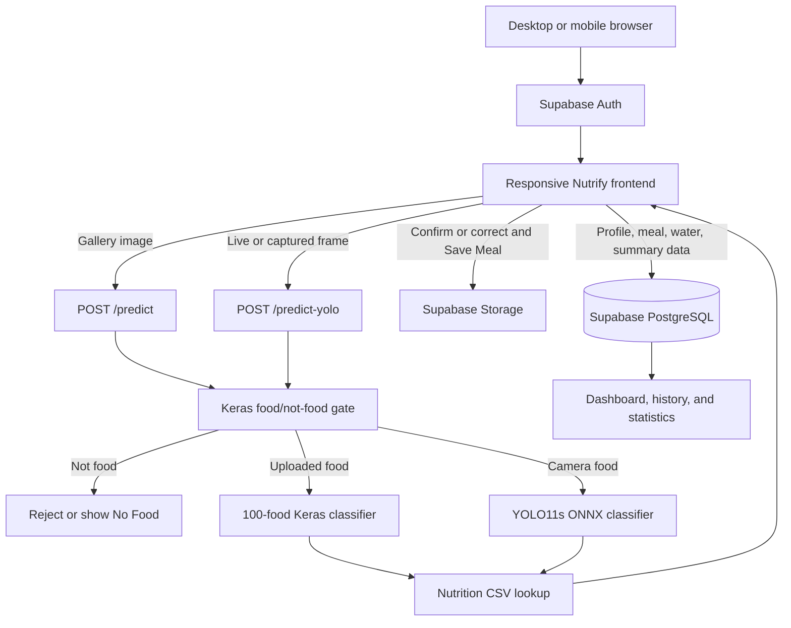

<p align="center">
  
</p>

<h1 align="center">Nutrify</h1>

<p align="center">
  AI-powered food recognition, nutrition tracking, and meal analytics for desktop and mobile browsers.
</p>

<p align="center">
  
  
  
  
  
  
</p>

## Project Summary

Nutrify is a responsive food-tracking web application that recognizes food from an uploaded image or a live camera, looks up nutrition values, and lets an authenticated user save the result as a meal. The application combines a FastAPI inference server, three trained computer-vision models, a vanilla HTML/CSS/JavaScript frontend, and Supabase for authentication, PostgreSQL data, and image storage.

The main classifier supports 100 food classes. Nutritional values are returned per 100 g and adjusted in the browser to the serving weight selected by the user. Saved meals feed the dashboard, daily/weekly/monthly history, hydration tracking, statistics, goals, streaks, and badges.

> Nutrify provides estimated nutrition information and is an academic project. It is not medical or dietary advice.

## Features

- Food/non-food validation before a classification is accepted
- 100-class food recognition from gallery uploads
- Continuous food recognition from a desktop or mobile camera
- Top-three predictions and confidence scores
- Protein, fat, carbohydrate, calorie, and health-score display
- Serving-size adjustment and breakfast/lunch/dinner/snack logging
- Email/password and Google authentication through Supabase
- Guided onboarding with profile, diet, activity, and nutrition goals
- Meal image storage and per-user meal history
- Daily dashboard, hydration tracking, weekly/monthly history, and statistics
- Responsive desktop, tablet, and mobile interface
- Light and dark themes
- Row Level Security (RLS) for user-owned Supabase records

## Tech Stack

| Area | Technology | Purpose |
| --- | --- | --- |
| Backend API | Python 3.11, FastAPI, Uvicorn | Serves the web app and inference endpoints |
| Uploaded-image ML | TensorFlow, Keras, NumPy | Food gate and 100-food image classification |
| Live-camera ML | YOLO11s classification export, ONNX Runtime | Lightweight continuous frame recognition |
| Image processing | Pillow | Decoding, resizing, and image metadata |
| Standalone camera test | OpenCV | Local webcam and sample-image testing |
| Frontend | HTML5, CSS3, vanilla JavaScript | Responsive SPA-style user interface |
| Authentication | Supabase Auth | Email/password sessions and Google OAuth |
| Database | Supabase PostgreSQL | Profiles, meals, hydration, summaries, and nutrition reference data |
| Image storage | Supabase Storage | Stores user-confirmed meal images |
| Environment | Conda | Reproducible Python environment |
| Mobile access | Responsive web UI, LocalTunnel | HTTPS browser access from a phone |

## Models and Their Jobs

Nutrify uses a two-stage decision for both upload and camera input: first decide whether the image contains food, then identify which supported food it contains.

| Model file | Model | Input | Used for |
| --- | --- | --- | --- |
| `model/food_or_not_food_detector_v2.keras` | EfficientNetV2S binary Keras classifier | `224 x 224` RGB, normalized to `[0, 1]` | Rejects non-food input before either recognition pipeline; food threshold is `0.5` |
| `model/food-100-version.keras` | EfficientNetV2B0-based Keras classifier | `380 x 380` RGB | Classifies uploaded gallery images into one of 100 food classes and returns the top three |
| `model/realtime_food_recognition_100_foods.pt` | Fine-tuned YOLO11s classification checkpoint | `224 x 224` RGB | Source checkpoint for real-time 100-food recognition |
| `model/realtime_food_recognition_100_foods.onnx` | ONNX export of the YOLO11s classifier | `1 x 3 x 224 x 224`, normalized to `[0, 1]` | Runs browser-camera frames efficiently through ONNX Runtime |
| `model/realtime_food_recognition_100_foods_classes.txt` | Ordered class labels | 100 lines | Maps real-time model output indexes to food names |

Despite the route name `/predict-yolo`, the current YOLO11 model is a **classification model**, not an object detector: it returns a food label and confidence, not bounding boxes.

Nutrition is not predicted by a neural network. The backend maps the recognized class to `data_exploration/target_hundred_whole_food_nutrition_info.csv`. The frontend can also use Supabase table `food_nutrition` for corrected labels and fallback values.

The health score is a rule-based value from 0 to 10 calculated from protein, fat, carbohydrate, and calories in `main.py`.

## System Architecture



## Complete Application Workflow

### 1. Authentication and onboarding

1. The root URL `/` displays the login/sign-up page.
2. The user signs in with email/password or Google OAuth.
3. Supabase creates and maintains the authenticated session.
4. The app redirects the user to `/app`.
5. If height or weight is missing, onboarding collects gender, birth date, activity level, diet type, goal, height, and weight.
6. The browser calculates initial calorie and macro goals and saves the profile to `user_profiles`.

### 2. Recognize a gallery image

1. The user opens **Log Meal** and selects or drops a JPEG/PNG image.
2. The browser sends the file as `multipart/form-data` to `POST /predict`.
3. The Keras food detector resizes the image to `224 x 224`, normalizes it, and rejects it when the food score is below `0.5`.
4. Accepted images are resized to `380 x 380` and passed to the 100-food Keras classifier.
5. The backend returns the best label, confidence, top three labels, image dimensions, nutrition values, and health score.
6. The user confirms the result or chooses the correct food from Supabase `food_nutrition` data.
7. The user selects a serving weight and meal type.
8. Clicking **Save Meal** uploads the image to the `food-images` bucket, inserts an image row into `food_images`, and inserts the serving-adjusted meal into `meals`.

### 3. Recognize food with the camera

1. The user opens the camera and grants browser permission.
2. The browser prefers the rear-facing camera on mobile devices.
3. A reduced JPEG frame is sent to `POST /predict-yolo` approximately every 700 ms.
4. The same Keras food gate rejects non-food frames.
5. Food frames are normalized and passed to the ONNX real-time classifier.
6. The live label and confidence are displayed without saving every frame.
7. The user captures a full-resolution frame, confirms or corrects it, selects serving details, and saves it as a meal.

### 4. Track and analyze

1. `meals` stores meal type, serving size, nutrients, time, and an optional image reference.
2. `water_logs` stores hydration additions.
3. The dashboard reads today's meals, water, and goals.
4. The browser upserts `daily_summaries` for daily totals and goal status.
5. History displays daily meals and weekly/monthly summaries.
6. Statistics calculates totals, streaks, goal percentages, common foods, meal-type distribution, and badges.

## Project Structure

```text
Nutrify/
|-- main.py                         # FastAPI app, model loading, and inference
|-- frontend/
|   |-- auth.html                   # Supabase login and registration UI
|   |-- index.html                  # Main responsive application
|   |-- app.js                      # Prediction, camera, correction, and meal saving
|   |-- tracker.js                  # Dashboard, meals, hydration, summaries
|   |-- history.js                  # Daily/weekly/monthly history
|   |-- stats.js                    # Statistics and badges
|   |-- onboarding.js               # Initial profile and goal setup
|   |-- profile.js                  # Profile editing
|   |-- upload.js                   # Supabase image upload helper
|   `-- styles.css                  # Desktop and mobile styles
|-- model/                          # Keras, PyTorch, ONNX, and class-name files
|-- notebooks/                      # Data preparation and model training notebooks
|-- scripts/
|   `-- realtime_food_detection.py  # Standalone OpenCV/ONNX tester
|-- data_exploration/               # USDA exploration and nutrition CSV
|-- supabase/
|   `-- migrations/                 # Database, RLS, triggers, seeds, and storage setup
|-- config/
|   `-- environment.yml             # Conda environment definition
`-- sample_food_images/             # Optional local test images
```

## Setup From Scratch

### Prerequisites

- Git
- Conda or Miniconda
- Python 3.11 through the supplied Conda environment
- A Supabase project
- Node.js/npm only if using Supabase CLI through `npx` or LocalTunnel
- A webcam and an HTTPS URL for mobile camera testing

TensorFlow support can vary by Python version and platform. Use the repository's Python 3.11 environment rather than the unrelated `food-vision` Python 3.13 environment.

### 1. Clone the repository

```bash
git clone https://github.com/PaingLinHtike/Nutrify.git
cd Nutrify
```

The trained model files are committed under `model/`. Confirm that these files are present before starting the server:

```text
model/food-100-version.keras
model/food_or_not_food_detector_v2.keras
model/realtime_food_recognition_100_foods.pt
model/realtime_food_recognition_100_foods.onnx
model/realtime_food_recognition_100_foods_classes.txt
```

### 2. Create the Python environment

```bash
conda env create -f config/environment.yml
conda activate nutrify
```

If the environment already exists, update it with:

```bash
conda env update -n nutrify -f config/environment.yml --prune
conda activate nutrify
```

### 3. Create and configure Supabase

1. Create a project at [supabase.com](https://supabase.com/).
2. Open **Project Settings > API** and copy the project URL and publishable/anon key.
3. Replace `SUPABASE_URL` and `SUPABASE_ANON_KEY` in both `frontend/auth.html` and `frontend/index.html` when using a different Supabase project.
4. Apply the repository migrations in timestamp order.

Using the Supabase CLI:

```bash
npx supabase login
npx supabase link --project-ref YOUR_PROJECT_REF
npx supabase db push
```

Alternatively, paste each SQL file into the Supabase SQL Editor in this order:

1. `supabase/migrations/20260812121045_complete_schema.sql`
2. `supabase/migrations/20260817000000_fix_user_profiles_rls.sql`
3. `supabase/migrations/20260819000000_food_images_bucket.sql`

The migrations create the application tables, RLS policies, profile trigger, nutrition seed data, and public `food-images` storage bucket. User images are stored under `uploads/{user_id}/...`.

### 4. Configure authentication

1. Enable the Email provider in **Authentication > Providers**.
2. Decide whether users must confirm their email before signing in.
3. For Google login, enable the Google provider and supply its OAuth client ID and secret.
4. Add local and tunnel callback URLs to **Authentication > URL Configuration**. Typical redirect URLs are `http://localhost:8000/app` and `https://YOUR-TUNNEL-URL/app`.
5. Add Supabase's OAuth callback URL to the authorized redirect URIs in Google Cloud when Google login is enabled.

### 5. Start the application

Run commands from the repository root because `main.py` uses paths relative to that directory.

```bash
conda activate nutrify
uvicorn main:app --host 0.0.0.0 --port 8000 --reload
```

You can also run:

```bash
python main.py
```

At startup, the terminal should report that the Keras models, ONNX model, and nutrition data loaded. Open:

- Web app: [http://localhost:8000](http://localhost:8000)
- API documentation: [http://localhost:8000/docs](http://localhost:8000/docs)

## Run Locally on Desktop

1. Activate the `nutrify` Conda environment.
2. Start Uvicorn from the repository root.
3. Visit `http://localhost:8000` in Chrome, Edge, Firefox, or Safari.
4. Sign up or sign in.
5. Complete onboarding if prompted.
6. Open **Log Meal** and upload a photo of one of the supported foods, or allow camera access.
7. Confirm/correct the result, select a meal type and serving size, and click **Save Meal**.
8. Check Dashboard, History, and Statistics to verify persistence.

Desktop camera access works on `localhost`, which browsers treat as a secure context.

## Run on a Mobile Phone

Nutrify currently has a responsive mobile web version; there is no separate Android APK, iOS app, React Native app, or Expo project.

### Recommended: HTTPS tunnel

1. Connect the development computer to the internet and keep Uvicorn running on port `8000`.
2. Open a second terminal in the repository root.
3. Start LocalTunnel:

```bash
npx --yes localtunnel --port 8000
```

4. LocalTunnel prints a temporary URL such as `https://random-name.loca.lt`. The URL changes between sessions unless a subdomain is available.
5. Add that URL and `https://random-name.loca.lt/app` to the Supabase redirect allow list when testing authentication or Google OAuth.
6. Open the HTTPS URL on the phone and sign in.
7. Tap **Log Meal > Take Photo**, grant camera permission, and test live recognition or capture.

HTTPS is required for `navigator.mediaDevices.getUserMedia()` on a phone. Opening `http://COMPUTER_IP:8000` over Wi-Fi may display the app, but most mobile browsers will block the camera because that address is not a secure context.

If the tunnel opens but the camera does not:

- Verify that the URL begins with `https://`.
- Allow camera permission in the phone's site settings.
- Use Safari on iOS or a current Chrome-based browser on Android.
- Confirm that another app is not using the camera.
- Keep both the Uvicorn and LocalTunnel terminals running.

## Standalone Real-Time Model Test

The optional script tests the ONNX model independently of FastAPI and Supabase. OpenCV is not included in the base Conda file, so install it first:

```bash
pip install opencv-python
```

Run the webcam:

```bash
python scripts/realtime_food_detection.py
```

Run one image or all sample images:

```bash
python scripts/realtime_food_detection.py path/to/apple.jpg
python scripts/realtime_food_detection.py --samples
```

Press `q` or `Esc` to close webcam mode. The `--samples` option requires images in the locally populated `sample_food_images/` directory; that dataset is ignored by Git.

## API Reference

### Pages

| Method | Route | Description |
| --- | --- | --- |
| `GET` | `/` | Authentication page |
| `GET` | `/auth` | Authentication page |
| `GET` | `/app` | Main application; frontend session guard redirects signed-out users |
| `GET` | `/docs` | Interactive FastAPI API documentation |

### `POST /predict`

Classifies an uploaded image using the food gate and Keras 100-food model.

```bash
curl -X POST http://localhost:8000/predict \
  -F "file=@path/to/apple.jpg"
```

Example successful response:

```json
{
  "is_food": true,
  "food_detection_confidence": 0.98,
  "prediction": "apple",
  "confidence": 0.91,
  "top_predictions": [
    { "label": "apple", "confidence": 0.91 }
  ],
  "nutrition": {
    "protein": 0.3,
    "fat": 0.2,
    "carbohydrate": 14.0,
    "calories": 52,
    "health_score": 9.0
  },
  "image_width": 1280,
  "image_height": 853
}
```

Non-food input returns HTTP `400`. If the upload classifier is unavailable, the endpoint returns HTTP `503`.

### `POST /predict-yolo`

Classifies a live or captured camera frame using the food gate and ONNX 100-food model. It accepts the same multipart `file` field and returns the same core prediction fields plus `recognition_model` for food input.

There is no backend `/confirm` route. When a user clicks **Save Meal**, the browser writes the image and meal directly to Supabase under the authenticated user's RLS policies.

## Database and Storage

| Resource | Purpose |
| --- | --- |
| `user_profiles` | Personal details, activity, diet, and goals |
| `food_images` | Stored image URL, dimensions, final label, confidence, and source |
| `meals` | Serving size, meal type, nutrients, timestamp, and image link |
| `water_logs` | Hydration entries |
| `daily_summaries` | Daily totals and goal completion used by history/statistics |
| `food_nutrition` | Food list and per-100 g nutrition used for corrections/fallback |
| `user_allergies`, `user_diseases` | Schema for future personalized health features |
| `food-images` bucket | Public meal images with per-user upload/delete policies |

The application uses the Supabase publishable/anon key in the browser. This is expected for Supabase applications; access control must remain enforced by RLS. Never place a Supabase service-role key in frontend code.

## Training and Data Workflow From Scratch

The trained binaries are already included, so model training is not required to run the application. To reproduce or extend the ML pipeline:

1. Use `notebooks/data_download.ipynb` to acquire the food image data.
2. Use `notebooks/train_test_split.ipynb` to create training and validation folder splits.
3. Train/evaluate the uploaded-image classifier with `notebooks/00_food_vision_100_food_model_test.ipynb`.
4. Train the binary EfficientNetV2S food gate with `notebooks/train_food_not_food_accuracy_colab.ipynb`.
5. Fine-tune and export the YOLO11s real-time classifier with `notebooks/fine_tune_yolo11_food_detection.ipynb`.
6. Copy matching `.keras`, `.pt`, `.onnx`, and class-name exports into `model/`.
7. Explore or update USDA-derived nutrition data with `data_exploration/usda_food_data_exploration.ipynb`.
8. Keep class names, class order, nutrition aliases, CSV rows, and Supabase `food_nutrition` rows synchronized.
9. Start the API and test both `/predict` and `/predict-yolo` before testing the full UI.

The image datasets are intentionally ignored by Git because of their size. Training notebooks are designed for notebook/Colab workflows and may require extra packages such as `ultralytics`, Jupyter, and GPU-specific libraries that are not needed by the production inference environment.

## Troubleshooting

### A model fails during startup

- Confirm all files listed in **Setup From Scratch** exist and are complete.
- Start the server from the repository root.
- Use Python 3.11 from `conda activate nutrify`.
- Ensure the ONNX class-name file belongs to the matching ONNX export.

### Login works but data does not save

- Confirm all three Supabase migrations were applied in order.
- Check the browser console and Supabase logs for RLS errors.
- Verify that the user has an authenticated session.
- Confirm the `food-images` bucket and storage policies exist.

### Google sign-in returns a redirect error

- Add the current local/tunnel URL to Supabase's redirect allow list.
- Add the Supabase OAuth callback URL to Google Cloud's authorized redirect URIs.
- Remember that a LocalTunnel URL can change after restart.

### Mobile camera is unavailable

- Use an HTTPS tunnel, not a plain LAN IP.
- Grant camera permission and reload the page.
- Check that the browser supports `getUserMedia`.

### Nutrition is missing for a prediction

- Check that the class has a matching row or alias in the nutrition CSV.
- For corrected labels, check the Supabase `food_nutrition` seed/table.
- Keep names consistent across model labels, CSV values, and database rows.

## Legacy Google Cloud Helpers

`google_credentials.py`, `image_uploader.py`, `utils.py`, and `save_to_gsheets.py` remain in the repository from an earlier Google Cloud Storage/Google Sheets workflow. They are not called by the current FastAPI prediction routes or meal-saving frontend. The active application persists data through Supabase, and `TEST_NUTRIFY_ENV_VAR` only affects the legacy Sheets helper.

Do not commit Google service-account JSON files or other secrets.

## License

This project is academic coursework for CS-601. All rights reserved unless a separate license is added.
